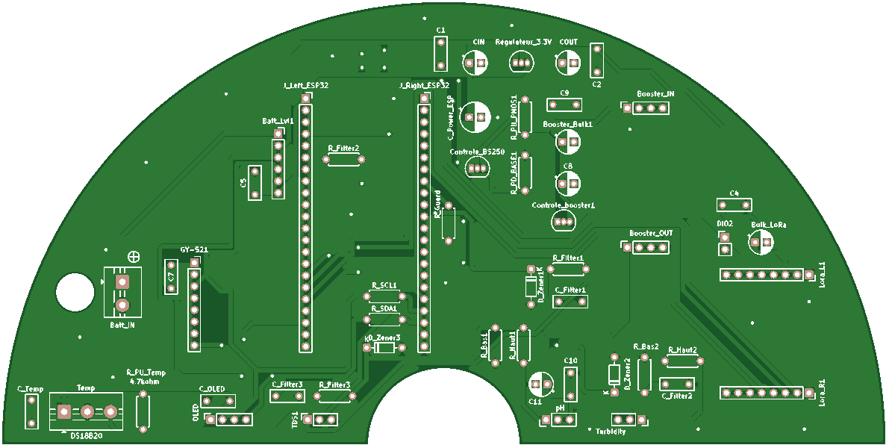

 

# EauSûre Measurement Node PCB

Travail de conception PCB du nœud de mesure de la solution EauSûre.

Ce dossier contient :
- les sources KiCad du circuit principal ;
- une version inoptimisée du schéma ;
- une version simplifiée du schéma ;
- les exports visuels du schéma et du PCB ;
- un backup de fabrication avec gerbers et perçages.

## Portée

Ce dépôt documente la carte électronique du nœud de mesure EauSûre, support matériel utilisé pour :
- acquérir les paramètres physico-chimiques de l'eau : pH, TDS, turbidité et température ;
- embarquer l'unité de calcul ESP32-S3 chargée du traitement local et de la coordination des sous-ensembles ;
- intégrer le module inertiel dédié à la détection de chute et aux événements critiques ;
- assurer l'interface avec la communication LoRa sécurisée vers la passerelle ;
- supporter les phases de provisioning, d'appairage et de maintenance distante du nœud.

## Stack

- KiCad
- schématique électronique
- routage PCB
- exports SVG, PNG et PDF
- gerbers et fichiers de perçage

## Organisation du dossier

- [source](source)
  - sources KiCad principales du projet
- [exports/schematics](exports/schematics)
  - exports du schéma complet et du schéma simplifié
- [exports/board](exports/board)
  - exports visuels du PCB
- [fabrication](fabrication)
  - backup de fabrication et gerbers

## Sources principales

- [eausure-measurement-node.kicad_pcb](source/eausure-measurement-node.kicad_pcb)
- [eausure-measurement-node.kicad_pro](source/eausure-measurement-node.kicad_pro)
- [eausure-measurement-node.kicad_prl](source/eausure-measurement-node.kicad_prl)
- [eausure-measurement-node-full.kicad_sch](source/eausure-measurement-node-full.kicad_sch)
- [eausure-measurement-node-simplified.kicad_sch](source/eausure-measurement-node-simplified.kicad_sch)

## Variantes du schéma

- **Version inoptimisée** : schéma utilisé lors de la fabrication du pcb du nœud de mesure chez JLCPCB China.
- **Version simplifiée** : version la plus récente du schéma avec lisibilité ameliorée 

## Rôle du nœud de mesure dans EauSûre

Le nœud de mesure constitue le cœur embarqué de la bouée intelligente EauSûre.

Il assure notamment :
- l'acquisition périodique des mesures de qualité de l'eau ;
- le traitement local et la préparation des données avant transmission ;
- la détection de secousses anormales via le MPU6050 ;
- la communication LoRa point-à-point chiffrée avec la passerelle ;
- l'exécution de commandes distantes ;
- l'intégration dans les cycles de provisioning, d'appairage sécurisé et de mise à jour firmware.

## Aperçu du PCB

  

## Fichiers de fabrication

Le dossier [fabrication](/home/adamdev/Bureau/Projet_pfe_eausure/PCB/fabrication) contient :
- les couches cuivre ;
- les masques ;
- les silkscreens ;
- les fichiers de perçage ;
- le fichier `gbrjob` ;

